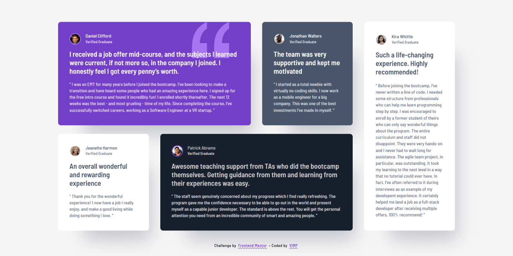

# 🚀 Testimonials grid section

Responsive testimonials grid built with semantic HTML and modern CSS.  
Focused on layout, structure, and maintainability using CSS Grid and `@layer`.

---

## 🔗 Links

- 🌎 [Live site](https://vimpdev.github.io/fem-junior-htmlcss-03-testimonials-grid-section/)
- 📌 [Frontend Mentor solution](https://www.frontendmentor.io/solutions/testimonials-grid-section-responsive-css-grid-layout-WVOChe5Hsj)

---

## 🎬 Demo

---

## 📸 Screenshots

| 📱 Mobile | 📲 Tablet | 🖥️ Desktop |
| --- | --- | --- |
|  |  |  |

--- 

## 🧠 Overview

This is a solution to the [Testimonials grid section challenge on Frontend Mentor](https://www.frontendmentor.io/challenges/testimonials-grid-section-Nnw6J7Un7).

The goal was to build a responsive layout that adapts across breakpoints while keeping a clean structure in both HTML and CSS.

---

## ⚙️ Built with

- Semantic HTML5
- CSS Custom Properties (Design Tokens)
- CSS Grid
- Mobile-first workflow
- CSS `@layer` for style organization

---

## 🎯 Key Features

- Responsive grid layout (mobile → tablet → desktop)
- Cards with different spans using CSS Grid
- Reusable component structure (`.testimonial`)
- Variant-based styling (`--primary`, `--secondary`, etc.)
- Design tokens for colors and typography
- Accessible HTML structure (headings, landmarks, hidden text)

---

## 🧩 What I learned during this project

- How to structure CSS using `@layer` to separate concerns (reset, base, layout, components, responsive)
- Why relying only on `nth-child` can make layouts harder to maintain
- How to handle grid spans across different breakpoints
- How to use design tokens to keep styles consistent
- The importance of semantic HTML and accessible markup

---

## 💭 Thoughts

This project helped me move from just “making layouts work” to thinking more about structure and maintainability.

I focused on organizing my CSS in a way that could scale better in larger projects, and being more intentional with class naming and layout decisions.

---

## 🤖 AI Collaboration

AI was used as a support tool during the development.

- Reviewed HTML semantics and accessibility decisions
- Helped validate CSS structure and naming conventions
- Explored different approaches for responsive layouts

Suggestions were evaluated and adapted as part of the learning process, focusing on understanding **why** a solution works rather than just applying it.

---

## 👩‍💻 Author

- Frontend Mentor – [@vimpdev](https://www.frontendmentor.io/profile/vimpdev)

---

## 🏁 Acknowledgments

Thanks to Frontend Mentor for providing practical challenges that help improve real-world frontend skills.